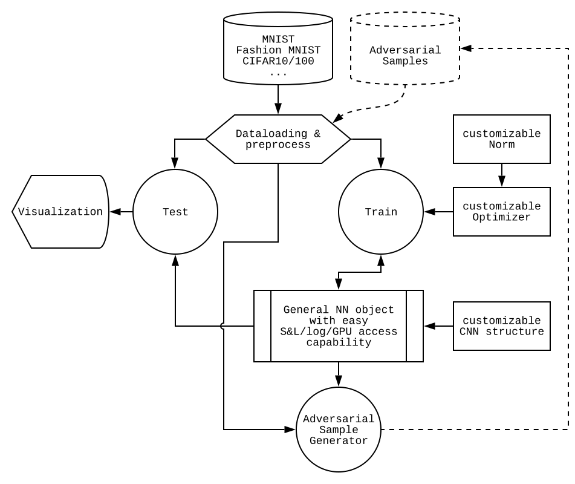

# Beta Release Note:

This is the initial release for "regularizeCNN". Current release provides few working demo and the majority parts of the project.

## Structure:
\*\* Note, this is not fully completed in current beta.

  

## System requirements:
### Hardware (recommended)
*  i7-950 or equivalent
*  8G+ DRAM
*  Nvidia Geforce GPU with CUDA capability. 8G graphics memory.

### Hardware (only for small batch evaluation)
*  i7-950 or equivalent
*  8G+ DRAM

### OS/Build Environment
\*\* Listed is my working environment. Some other may also work. Recommend using Anaconda for environment management.

\*\* Some Python 3.7+ releases may have compatibility issue with Pytorch 1.1.0

*  Win7/8/10 /Ubuntu 18.04+/ Debian 9.7.0+
*  Python 3.6.8
*  Pytorch 1.1.0 + torchvision 0.3.0
*  numpy 1.16.3
*  matplotlib 3.0.1

## Usage:
**run_all.py** : Train a new neural-net with specified dataset and save to file "\*.model". By default, it will use CIFAR10 as dataset and save to "test.model"

**adversary_demo.py** : Load a pre-trained net from file and generate adversary samples that can fool the net.
